# 基于SpringBoot充电桩充电站微信小程序

# 获取地址

#### 作者QQ：3275035005 微信：xkbishe123 (支持修改、 部署调试、 代做接毕业设计和课程设计)

#### 接网站建设、小程序、H5、APP、各种系统、样式修改等

#### 选题+开题报告+任务书+程序定制+安装调试+论文+答辩ppt 都可以做

#### 问题包修改，包满意，有需求尽管甩过来！一条龙帮你安心过！

#### 所有项目以及源代码本人均调试运行无问题 可支持远程调试运行

# 一、项目介绍
基于SpringBoot充电桩充电站微信小程序，本系统分微信小程序和管理后台两部分，项目采用前后端分离
- 1、用户功能：
        微信登录、查看充电站、查看充电桩、充电站地图定位、扫码充电、余额充值、资金明细、订单查看、冻结金额、常见问题微信头像上传信息等等功能
-  2、管理员功能：
        登录、首页、充电站管理、充电桩管理、订单管理、常见问题管理、用户管理、资金明细管理、密码修改、个人信息修改
-  3、功能亮点：
        充电站地图定位功能、扫码充电功能、充电桩生成二维码、微信登录
# 二、技术框架
### 1、后端
* 核心框架：SpringBoot
* 持久层框架：Mybatis
* 数据库：MySql
### 2、前端
- Vue
- Element-UI
- 微信小程序
# 三、项目截图
### 1. 管理端
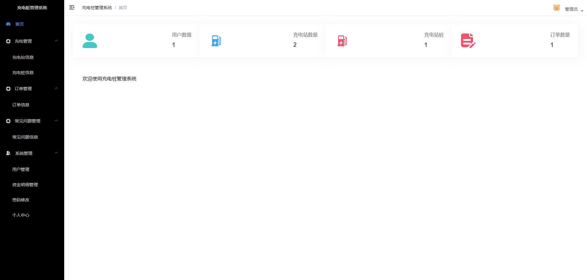
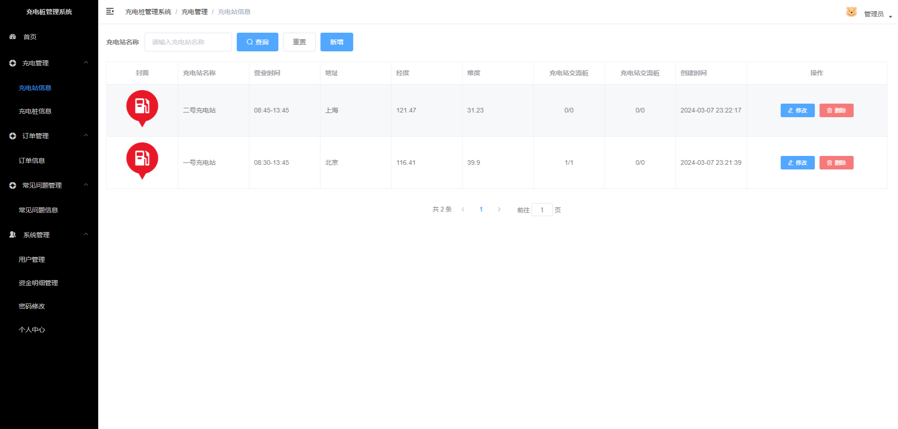
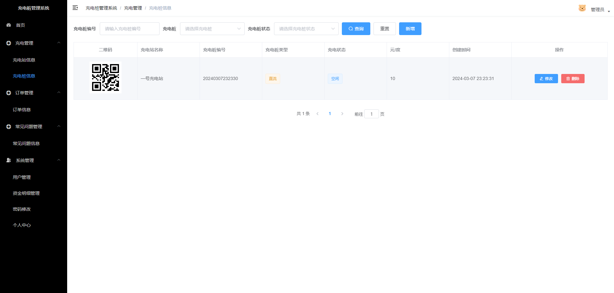
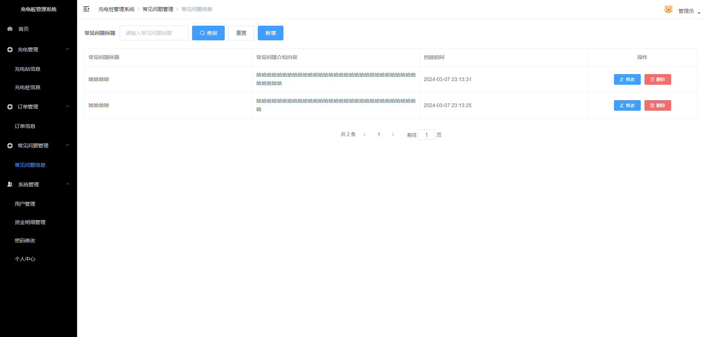
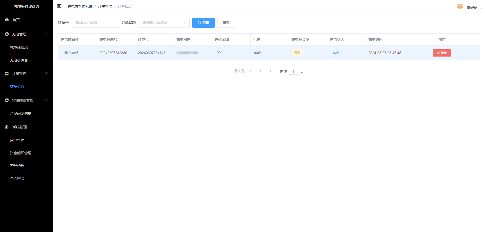
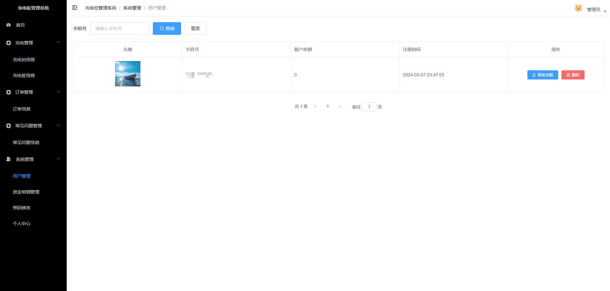
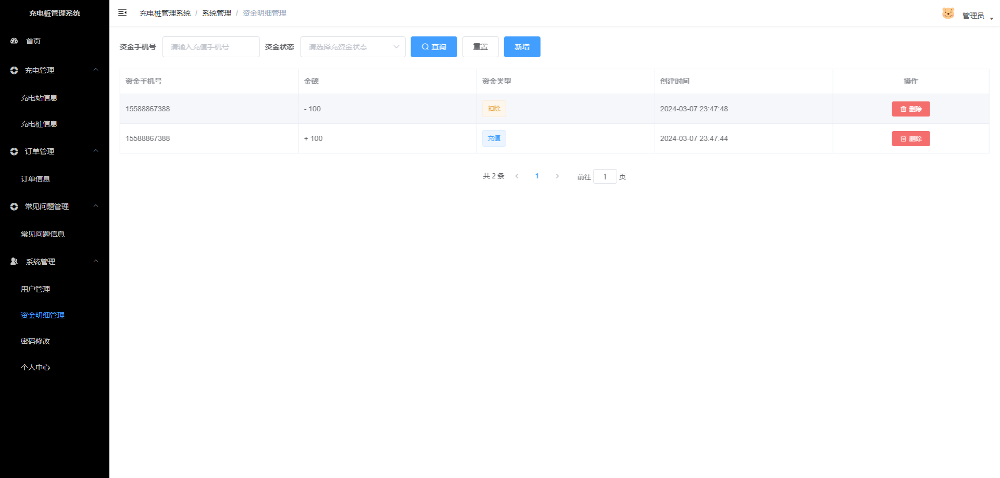
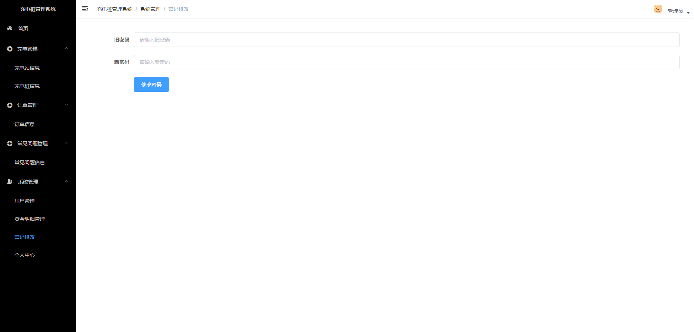
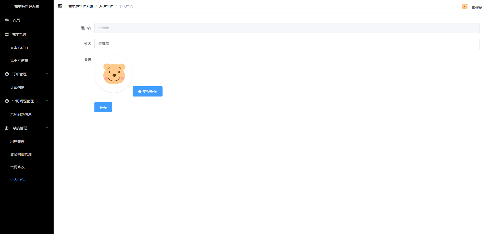

### 2. 微信端

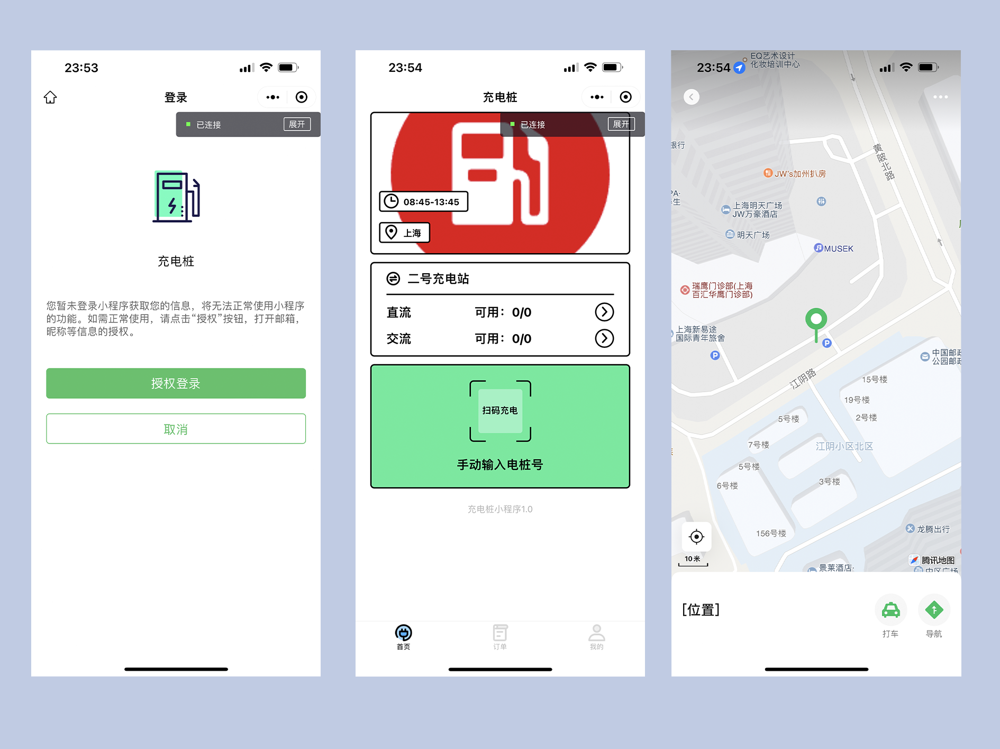

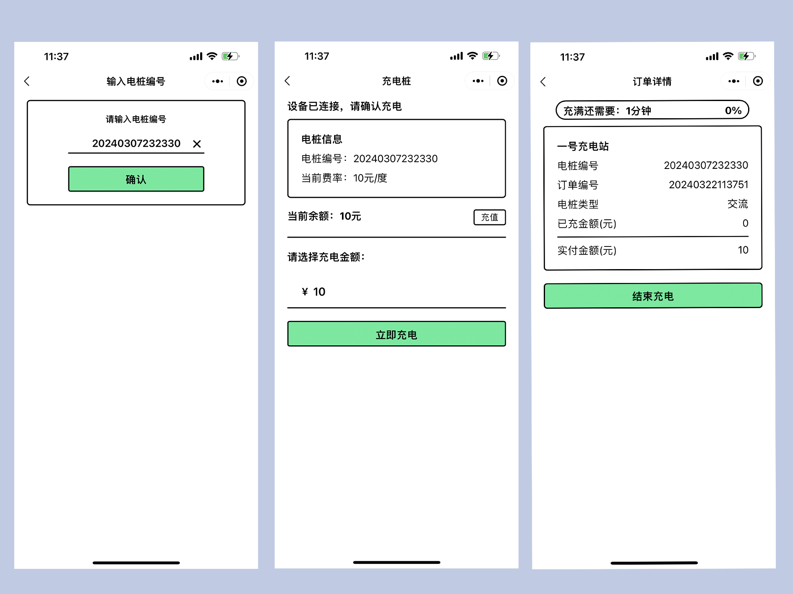

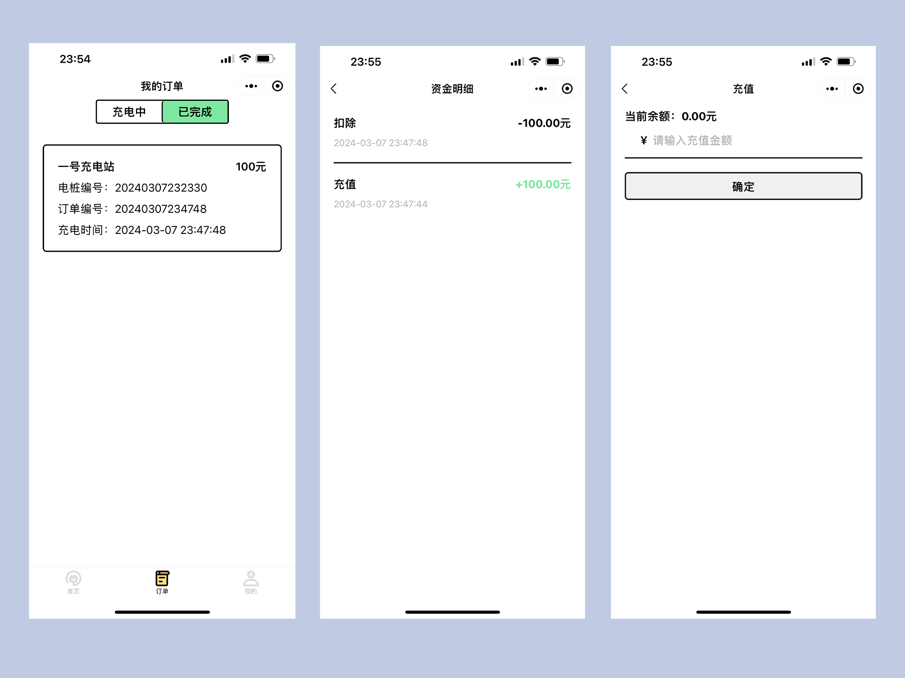

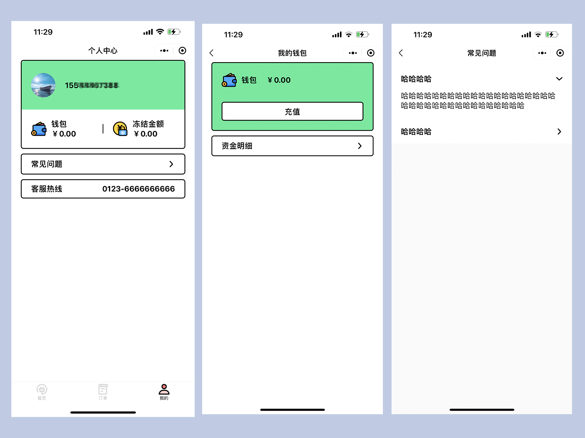
